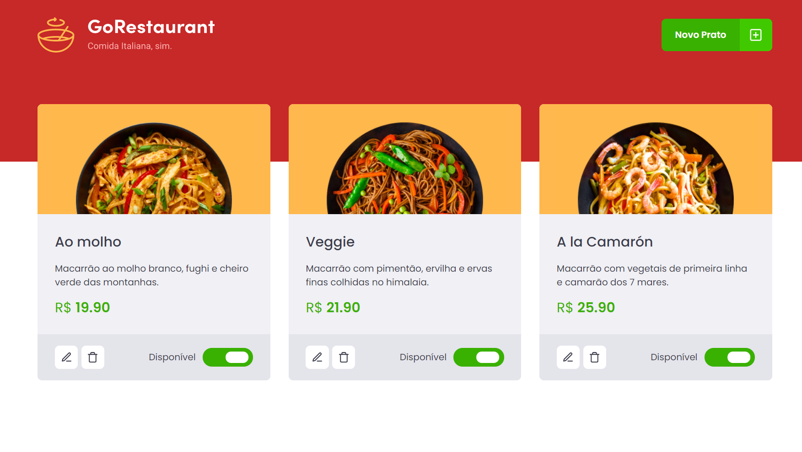

# GoStack | GoRestaurant

> A web application developed at the GoStack Bootcamp that does a CRUD operation.

# Getting Started

Follow the steps below to properly run this application.

### `1. git clone <repository_url>`

Clone the repository using the following command:  
`git clone https://github.com/gasscoelho/gostack-reactjs-crud.git`

After that, you can open the project using an editor of your preference.

---

### `2. yarn`

Install the project dependencies.

If you are using NPM then run `npm install`

---

### `3. yarn json-server --watch server.json -p 3333`

We're using the `json-server` to represent a REST API.

If you are using NPM then run `yarn json-server --watch server.json -p 3333`

---

### `4. yarn start`

Runs the app in the development mode. 
Open [http://localhost:3000](http://localhost:3000) to view it in the browser.

If you are using NPM then run `npm start`

## Built With

✨ ReactJS  
✨ TypeScript  
✨ Styled-Components  
✨ JSON Server & more!  

## Author

**Gabriel Coelho** - Full Stack Developer
